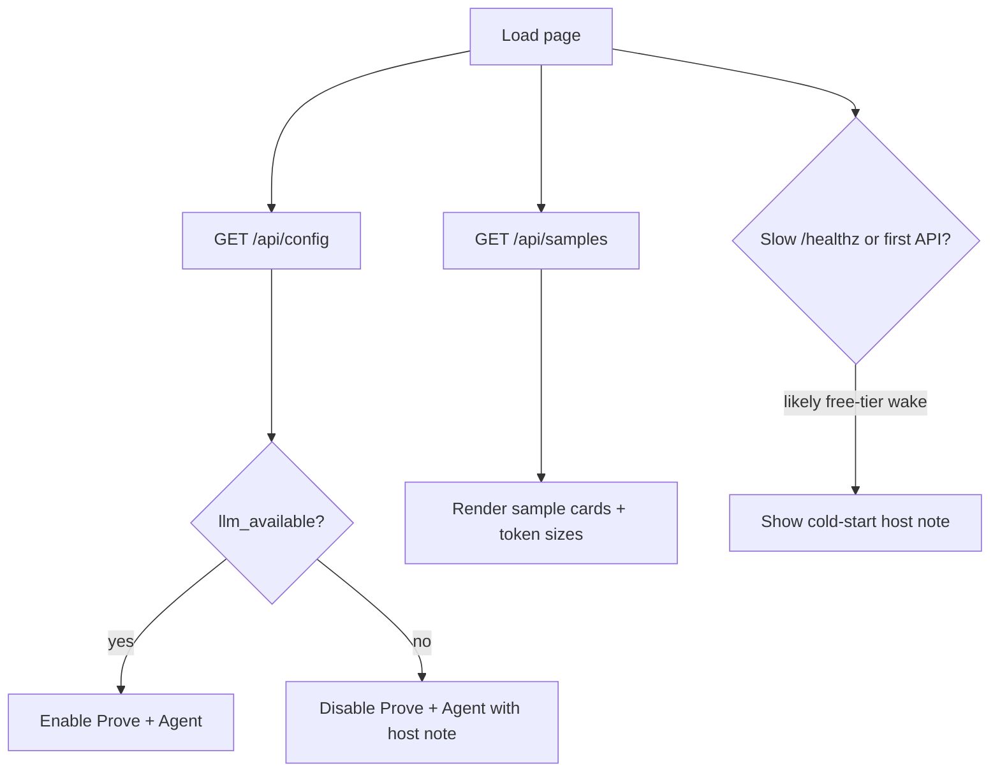
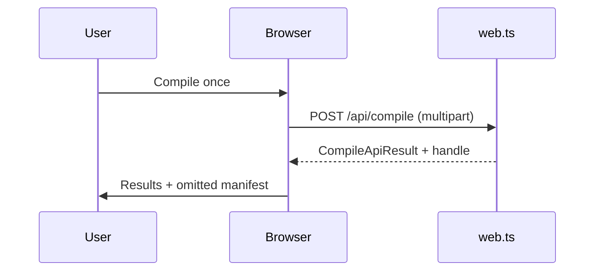

# UI / UX Flow — Demo

**Status:** Current  
**Implementation:** `public/index.html`, `src/client/app.ts`, `public/style.css`

---

## 1. Entry and cold start

**Current behavior:** On hosted free tiers, the first hit after idle can take 30–60s. The UI surfaces a cold-start note so users do not interpret silence as a broken form.

---

## 2. Happy path — Compile once

1. User selects a **sample** or chooses a **file**.
2. For uploads, client may call **`POST /api/measure`** so the budget presets scale to real converted tokens; samples already carry `tok` from `/api/samples`.
3. User sets **task** (or clicks a suggested question chip) and **token budget**.
4. Clicks **Compile once** → loading banner (“Converting… / Compiling…”); Cancel aborts via `AbortController`.
5. On success: results section shows raw vs compiled tokens, reduction, cost illustration, selected section cards, omitted chips, badges (cache / rank / omit).
6. Optional: toggle **See exact text sent to AI** (raw packed markdown).

---

## 3. Peek vs Include → Prove

**Amendment:** Expanding an omitted section started as inspection-only. Shipping behavior splits two intents:

| Action | UX | Effect on Prove |
| --- | --- | --- |
| Peek / expand | Loads section text under omitted list | Does **not** add tokens to Prove context |
| Include in Prove | Checkbox / control on an expanded section | Id sent as `expanded_ids`; merged into compiled side |

Flow:

1. After compile, user opens omitted chips → expand (peek).
2. Marks zero or more sections **Include in Prove**.
3. Effective Prove context note updates (compile tokens + included expands).
4. **Prove answer parity** (results) or **Prove…** (form power path) → side-by-side answers.

Edge: if LLM unavailable, Prove controls stay disabled with explanatory copy from `/api/config`.

---

## 4. Happy path — Agent

1. Same file + task + budget as Compile.
2. **Run agent** → SSE stream (`text/event-stream`): `step` events then `done` (or `error`).
3. Steps render as compile / expand / recompile / answer with reasoning snippets.
4. Optional **Compare to full file** uses opaque `parity_handle` from `done` (one-shot).

Soft ceiling: slider budget is start compile budget and soft `tokens_read` **content-token** ceiling; copy explains an in-flight expand may finish slightly over. Compile meters the same substance basis (`selected_content_tokens`).

---

## 5. Key edge states

| State | User-visible behavior |
| --- | --- |
| **Cold start** | Host note; wait for `/healthz` / first response |
| **Cancel / disconnect** | Cancel button aborts in-flight compile/prove/agent; server aborts LLM work when the request closes mid-stream |
| **Stale budget** | After a successful compile, moving the slider shows a note that on-screen results used a different budget; recompile or restore |
| **Early-stopped (spare budget)** | Floor note: coverage complete under the ceiling — not a failure; larger budget may add nothing |
| **0% reduction** | Selected content ≈ raw (everything kept that pack admitted) — presented as correct, not a failure. Not a “skip rank” shortcut |
| **Budget-bound / nothing fit** | Hint or empty selection + expand / raise-budget guidance; omit buckets separate size-blocked vs lower-relevance |
| **Rate limit (429)** | Error message; Retry-After; expect-box explains point costs |
| **LLM busy (503)** | Retry shortly; concurrency capped |
| **LLM unavailable** | Prove/Agent disabled with host note from `/api/config` |
| **Conversion failure (422)** | Generic conversion error; file may be unsupported/corrupt/empty convert |
| **Upload rejected (413/415)** | Inline file error (type, empty, bomb) |
| **Expired handle (404 on expand)** | “Recompile the file” |
| **Expired/consumed parity (410)** | Re-run agent, then compare |
| **Agent soft overshoot** | Last expand may finish slightly over ceiling — expected |
| **Loading** | Banner with spinner + title/detail; results panel not left showing stale empty chrome on first failure |
| **No samples** | Soft error; upload still works |
| **Multi-query task** | Attribution notes when compound questions split |

---

## 6. Numbered flows (compact)

### A. Sample → Compile → Peek → Include → Prove

1. Open sample card → chips populate.  
2. Pick question → set ~4k budget.  
3. Compile once → review selected sections.  
4. Expand a high-relevance omitted chip → Include in Prove.  
5. Prove answer parity → compare full vs compiled(+include).

### B. Form → Agent → Compare

1. Same inputs.  
2. Run agent → watch steps.  
3. Read answer + stop reason.  
4. Compare to full file (optional, costs same pool as Prove).

### C. Keyless host

1. Compile and expand fully available.  
2. Prove/Agent disabled; host note explains keys unlock those paths only.

---

## 7. Accessibility notes (flow-relevant)

- Skip link, focus-visible outlines, live regions for status / assertive errors.
- Sample cards and chips are real buttons; budget presets are toggles with active state.
- `prefers-reduced-motion` disables decorative pulse/grow animations.
- Section headings in results can take focus after compile for keyboard users.
